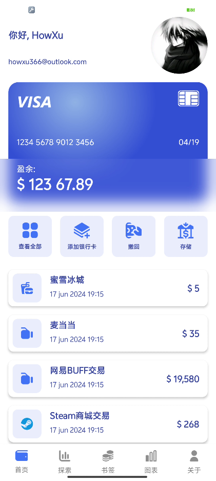
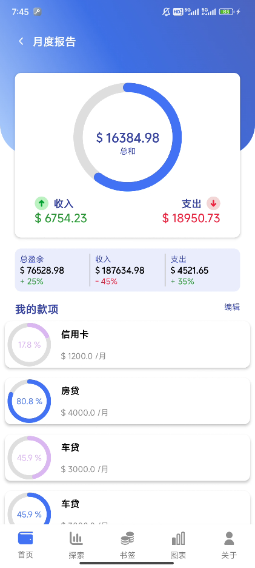

# Android Demo Accounting Book

demo of [UILover's project191](https://www.youtube.com/watch?v=ZcNKWcr-pKg&list=PLfcLDE6VDKRg73CjGR6-czb3jEiP3Hzom&index=22)
drawable resources from [Here](https://github.com/worldsat/project191#)  
colors in [colors.xml](./app/src/main/res/values/colors.xml)

# NOTE
some resources is not suitable for my device Redmi K50, I just resize them with ps.

# ScreenShot
You can push the visa card in Report Page
 

# Developing
There are only simple pages without simple data.   
You can dev it if u like
